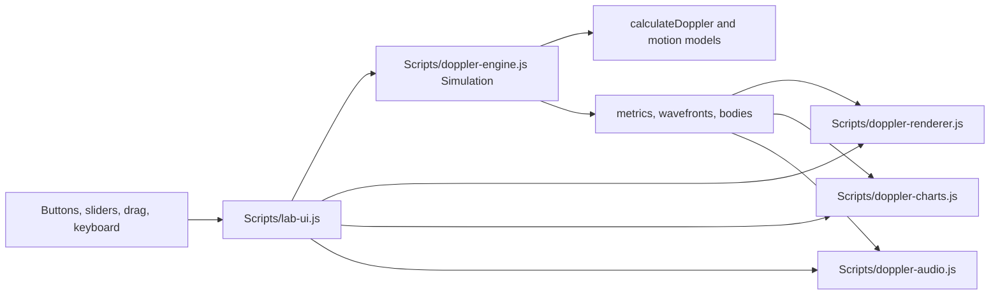

# Doppler Lab AI Project Handoff

> Do not assume a feature exists merely because it was requested previously. Treat only the inspected source code and verified runtime behavior as the current truth.

## Project Identity

`Doppler Lab` is an ASP.NET Web Forms educational website for exploring the Doppler effect. The project combines C# boot data, bilingual Arabic/English UI text, HTML5 canvas visualization, procedural Web Audio, quiz content, presenter slides, validation tests, and small application demonstrations.

- Main solution to use: `DopplerLab.sln`
- Older Web Site solution also present: `PhysicsDopplerEffect.sln`
- Web project: `PhysicsDopplerEffect/DopplerLab.csproj`
- ASP.NET model: Web Forms Web Application
- Target framework: .NET Framework 4.7.2
- Runtime: IIS Express or IIS with .NET Framework 4.7.2/4.8 installed
- Client stack: vanilla JavaScript, HTML5 canvas, Web Audio API, localStorage
- Database: none
- Internet at runtime: not required
- Default language: Arabic (`ar`)
- Supported languages: Arabic and English
- Direction behavior: `Scripts/localization.js` changes `html lang` and `dir` between `ar`/`rtl` and `en`/`ltr`

## Page List

| Page | Code-behind | Purpose | Navigation |
| --- | --- | --- | --- |
| `Default.aspx` | `Default.aspx.cs` | Home dashboard and module links | Header nav as Home |
| `Lab.aspx` | `Lab.aspx.cs` | Main interactive Doppler simulation | Header nav as Lab |
| `Applications.aspx` | `Applications.aspx.cs` | Police radar, ultrasound, astronomy, weather demonstrations | Header nav as Applications |
| `Compare.aspx` | `Compare.aspx.cs` | Sound Doppler vs relativistic light comparison | Header nav as Compare |
| `Quiz.aspx` | `Quiz.aspx.cs` | Twelve-question bilingual quiz | Header nav as Quiz |
| `Presenter.aspx` | `Presenter.aspx.cs` | Fifteen-slide presenter mode | Header nav as Presenter |
| `PhysicsValidation.aspx` | `PhysicsValidation.aspx.cs` | Server/client physics validation table | Footer link only |

## Main File Structure

```text
.
|-- DopplerLab.sln
|-- PhysicsDopplerEffect.sln
|-- PhysicsDopplerEffect/
|   |-- DopplerLab.csproj
|   |-- Web.config
|   |-- Site.Master
|   |-- Default.aspx
|   |-- Lab.aspx
|   |-- Applications.aspx
|   |-- Compare.aspx
|   |-- Quiz.aspx
|   |-- Presenter.aspx
|   |-- PhysicsValidation.aspx
|   |-- Content/
|   |-- Scripts/
|   |-- Services/
|   |-- Models/
|   |-- Assets/
|   |-- Bin/
|   `-- Tools/
|-- PrecompiledWeb/
`-- packages/
```

`PhysicsDopplerEffect/Bin`, `packages`, and `PrecompiledWeb/localhost_50347` are build/vendor/generated areas. The source-of-truth code is in `PhysicsDopplerEffect/`.

## Simulation Architecture

The main simulation is `Lab.aspx`. It loads:

1. `Scripts/doppler-engine.js`
2. `Scripts/doppler-audio.js`
3. `Scripts/doppler-renderer.js`
4. `Scripts/doppler-charts.js`
5. `Scripts/lab-ui.js`

`lab-ui.js` creates one `DopplerEngine.Simulation`, one `DopplerRenderer`, one `DopplerChartRenderer`, and one `DopplerAudio`. Its `frame(now)` function is the single animation loop. Each frame updates simulation time, requests metrics, draws the canvas, draws the chart, updates DOM metrics, and pushes audio parameters.



## Physics Model

Core acoustic formula in both `Scripts/doppler-engine.js::calculateDoppler()` and `Services/PhysicsCalculator.cs::Calculate()`:

```text
f_observed = f_emitted * (c - dot(observerVelocity, n)) / (c - dot(sourceVelocity, n))
n = normalize(observerPosition - sourcePosition)
```

The implementation uses radial velocity through the source-to-observer unit vector, not total speed. Sound speed is either a manual override or `331.3 + 0.606 * temperatureCelsius`. Frequency is clamped, sound speed is clamped, and the denominator has a near-sonic safety clamp.

Other implemented models:

- Linear pass: `linearKinematics(config, elapsed)` in `doppler-engine.js`
- Circular pass: `circularKinematics(config, elapsed)` in `doppler-engine.js`
- Retarded-time source sampling: `Simulation.prototype.findRetardedSample`
- Distance loudness: `distanceGain(distance)`
- Police radar: `renderRadar()` in `Scripts/applications.js`, `delta = 2 * f * v / c`
- Medical ultrasound: `renderUltrasound()`, `delta = 2 * f * v * cos(angle) / 1540`
- Relativistic astronomy: `renderAstro()`, `freqRatio = sqrt((1 - beta) / (1 + beta))`
- Sound/light compare: `renderCompare()`, classical sound factor plus relativistic light wavelength ratio

## Visual Entities

Active simulation sprites are loaded in `Scripts/doppler-renderer.js`:

| Entity | Asset | Sprite config |
| --- | --- | --- |
| Source motorcycle | `Assets/motorcycle-rider.png` | `worldHeight: 23`, `visualAnchor: {x:.5,y:.93}`, `acousticPoint: {x:.48,y:.67}` |
| Listener person | `Assets/listener-person.png` | `worldHeight: 25`, `visualAnchor: {x:.55,y:.96}`, `acousticPoint: {x:.62,y:.18}` |

`Assets/listener.svg` exists but is not referenced by the current renderer or pages. No active ambulance asset is present.

## Audio Model

`Scripts/doppler-audio.js` implements procedural motorcycle-like audio using Web Audio API:

- `DopplerAudio` owns the `AudioContext`, selected listener, enabled state, and voices.
- `EngineVoice` creates four oscillators plus tremolo and filtered noise.
- Harmonics use ratios `1`, `2`, `3`, and `4` with sawtooth/triangle/sine waves.
- Doppler factor changes oscillator frequencies.
- Distance gain changes loudness if enabled.
- Stereo panning uses `StereoPannerNode` when supported.
- Audio starts only after a user gesture through `audioBtn`.
- There is no recorded audio file and no remaining siren audio logic in active code.

## Movement Modes

| Mode | UI | Engine entry | Status |
| --- | --- | --- | --- |
| Manual drag | `manualBtn`, pointer events on `simCanvas` | `beginDrag`, `dragTo`, `endDrag` | Implemented |
| Linear automatic pass | `autoPassBtn` | `startAutoPass`, `applyLinearMotion`, `linearKinematics` | Implemented and smoke/browser-tested previously |
| Circular automatic motion | `circularMotionBtn` | `startCircularMotion`, `applyCircularMotion`, `circularKinematics` | Implemented and browser-tested previously |
| Presets | `presetSelect` | `applyPreset` | Implemented |

Circular controls: `circularDirection`, `circularRadius`, `circularSpeed`, `circularCenterMode`.

## Existing Feature Summary

- Bilingual Arabic/English layout and text.
- RTL/LTR switching and localStorage language persistence.
- Main Doppler canvas simulation with source, listeners, wavefronts, vectors, distance line, and path guides.
- Optional listener B.
- Chart of observed frequency, radial velocity, and distance.
- Freeze-and-analyze dialog.
- Prediction dialog.
- Challenge dialog and challenge score persistence.
- Procedural audio with Doppler pitch, loudness, stereo, and listener selection.
- Automatic linear and circular movement.
- Application modules for radar, ultrasound, astronomy, weather, and sound/light comparison.
- Quiz with scoring, shuffle, restart, reveal, previous/next, and presenter mode.
- Presenter slides with keyboard navigation, notes, fullscreen button, and hide-controls button.
- Physics validation page comparing server cases and browser extra tests.

## Known Issues and Incomplete Areas

| Issue | Severity | Location | Current truth |
| --- | --- | --- | --- |
| Two solution files can confuse new developers | Medium | `DopplerLab.sln`, `PhysicsDopplerEffect.sln` | Use `DopplerLab.sln` for the Web Application project |
| `PrecompiledWeb/localhost_50347` can become stale | Medium | `PrecompiledWeb/` | Generated copy, not source-of-truth |
| `Assets/listener.svg` appears unused | Low | `Assets/listener.svg` | Present on disk but not in active renderer/page references |
| Canvas labels are partially hardcoded English | Low | `doppler-renderer.js` | Examples include path labels and object labels drawn on canvas |
| Fullscreen behavior requires browser verification | Low | `fullscreenBtn`, `presenterFullscreen` | Static handlers exist; headless/fullscreen permissions were not fully verified in this run |
| Audible quality requires human hearing check | Low | `doppler-audio.js` | Programmatic audio toggling can be verified; subjective sound quality cannot |
| Browser test coverage in this documentation run was HTTP-only | Low | Runtime verification | All ASPX pages returned 200, but drag/canvas/audio interactions were not re-run with a browser during this handoff pass |
| TODO comments exist only inside vendored Roslyn targets | Low | `PhysicsDopplerEffect/Bin/roslyn/Microsoft.Managed.Core.targets` | Third-party build artifact, not application source |

## Important Element IDs

Lab core IDs:

`startPauseBtn`, `resetBtn`, `audioBtn`, `freezeBtn`, `autoPassBtn`, `circularMotionBtn`, `fullscreenBtn`, `simCanvas`, `chartCanvas`, `simulationWarning`, `predictionBtn`, `manualBtn`, `listenerBBtn`, `challengeBtn`, `circularDirection`, `circularRadius`, `circularSpeed`, `circularCenterMode`, `listenSelect`, `soundMode`, `sourceFrequency`, `sourceSpeed`, `observerSpeed`, `temperature`, `soundSpeedOverride`, `animationSpeed`, `dopplerToggle`, `loudnessToggle`, `stereoToggle`, `inertiaToggle`, `waveBtn`, `vectorsBtn`, `presetSelect`, `predictionDialog`, `freezeDialog`, `challengeDialog`.

Application IDs:

`radarCanvas`, `radarSpeed`, `radarFrequency`, `speedLimit`, `radarResults`, `ultrasoundCanvas`, `bloodSpeed`, `probeAngle`, `ultrasoundFrequency`, `ultrasoundResults`, `astroCanvas`, `astroBeta`, `emitWavelength`, `astroResults`, `weatherCanvas`, `weatherSpeed`, `weatherAngle`, `weatherResults`, `compareSoundCanvas`, `compareLightCanvas`, `compareVelocity`.

Quiz/presenter/validation IDs:

`presenterQuizMode`, `shuffleQuizBtn`, `restartQuizBtn`, `quizPosition`, `quizTopic`, `quizDifficulty`, `quizQuestion`, `quizChoices`, `quizExplanation`, `previousQuestionBtn`, `revealQuizBtn`, `nextQuestionBtn`, `quizScore`, `presenterPrev`, `presenterNext`, `presenterFullscreen`, `presenterHideControls`, `speakerNotes`, `speakerNoteText`, `serverPassCount`, `clientPassCount`, `maxError`, `validationRows`.

## Important JavaScript Functions

`doppler-engine.js`: `calculateDoppler`, `distanceGain`, `linearKinematics`, `circularKinematics`, `Simulation`, `Simulation.prototype.update`, `updateMotion`, `findRetardedSample`, `getMetrics`, `startAutoPass`, `startCircularMotion`, `applyPreset`, `beginDrag`, `dragTo`, `endDrag`.

`lab-ui.js`: `applySavedSettings`, `saveLabSettings`, `bindSlider`, `freezeAndAnalyze`, `renderPrediction`, `updateDom`, `renderChallenge`, `frame`.

`doppler-renderer.js`: `DopplerRenderer`, `loadImage`, `resize`, `toCanvas`, `toWorld`, `render`, `drawWavefronts`, `drawSprite`, `drawVectors`, `drawDistanceLine`.

`doppler-audio.js`: `DopplerAudio`, `DopplerAudio.prototype.start`, `stop`, `toggle`, `update`, `EngineVoice`, `EngineVoice.prototype.start`, `stop`, `update`.

`applications.js`: `renderRadar`, `renderUltrasound`, `renderAstro`, `renderWeather`, `renderCompare`, `drawCompareSound`, `drawCompareLight`.

`quiz.js`: `render`, `score`, `save`, `shuffle`, `currentQuestion`.

`presenter.js`: `render`, `next`, `prev`.

`localization.js`: `applyLanguage`, `setLanguage`, `getLanguage`, `t`, `stateLabel`, `toast`.

`physics-validation.js`: `runExtraTests`, `render`, `extraRow`.

## Important C# Classes

| Class | File | Purpose |
| --- | --- | --- |
| `DopplerLab.Global` | `Global.asax.cs` | ASP.NET application class; `Application_Start` is empty |
| `DopplerLab.SiteMaster` | `Site.Master.cs` | Active nav class assignment |
| `DopplerLab.Default`, `Lab`, `Applications`, `Compare`, `Quiz`, `Presenter`, `PhysicsValidation` | Page code-behind files | Populate `BootJson` |
| `DopplerLab.Services.PageBoot` | `Services/PageBoot.cs` | Serializes boot payloads |
| `DopplerLab.Services.LocalizationData` | `Services/LocalizationData.cs` | Arabic/English dictionary |
| `DopplerLab.Services.PhysicsCalculator` | `Services/PhysicsCalculator.cs` | Server-side physics and validation cases |
| `DopplerLab.Services.QuizRepository` | `Services/QuizRepository.cs` | Twelve quiz questions |
| `SimulationSettings`, `PhysicsResult`, `PhysicsTestCase`, `QuizQuestion`, `Vector2D` | `Models/` | DTOs and vector helper |

Server-to-client communication is through inline `window.DopplerBoot = <%= BootJson %>` scripts on each page.

## localStorage Keys

| Key | File | Purpose |
| --- | --- | --- |
| `doppler.language` | `localization.js` | Selected UI language |
| `doppler.labSettings` | `lab-ui.js` | Lab slider/toggle/preset settings |
| `doppler.challengeScore` | `lab-ui.js` | Challenge score |
| `doppler.quizOrder` | `quiz.js` | Quiz order |
| `doppler.quizState` | `quiz.js` | Answers, reveal state, index |
| `doppler.presenterIndex` | `presenter.js` | Current presenter slide |

`resetStorageBtn` in `Site.Master` clears all keys starting with `doppler.`.

## Localization Design

`Services/LocalizationData.cs` provides server boot dictionaries. `Scripts/localization.js` applies dictionary keys through `data-i18n` and per-element bilingual attributes such as `data-text-ar`, `data-text-en`, `data-aria-label-ar`, and `data-aria-label-en`. Equation blocks use LTR classes/attributes where needed.

The scan for common mojibake markers found no hits in application source files.

## Constraints Future Changes Must Preserve

- Preserve existing file names, page names, public IDs, and JavaScript global names unless a future task explicitly asks for renaming.
- Use `DopplerLab.sln`/`DopplerLab.csproj` as the source-of-truth build path.
- Keep Arabic and English text in sync.
- Keep formulas in C# and JavaScript aligned when changing physics.
- Keep `window.DopplerBoot` payloads compatible with existing scripts.
- Keep audio activation behind a user gesture.
- Do not treat `PrecompiledWeb/` as authoritative source.
- Do not rely on internet-hosted assets for core runtime.

## Recommended Next Development Steps

1. Decide whether to keep or remove the older `PhysicsDopplerEffect.sln` and generated `PrecompiledWeb/` from the working project.
2. Run a full browser regression pass after any source change, especially for canvas, audio, drag, and fullscreen.
3. Localize remaining hardcoded canvas labels if full bilingual consistency is required.
4. Remove or re-register unused `Assets/listener.svg` after confirming no future feature depends on it.
5. Add automated browser tests if the project will continue to evolve.
