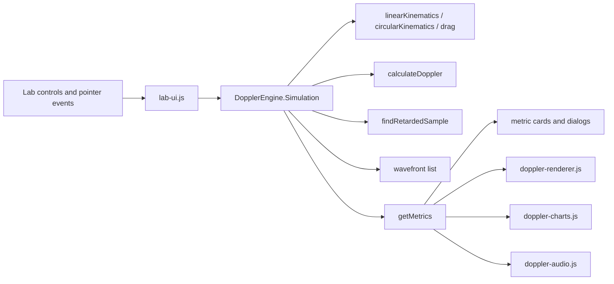

# Doppler Lab - Full Technical and Functional Documentation

Generated from static inspection and non-invasive verification on 2026-06-22.

This document describes the current inspected project. It does not describe requested or imagined future behavior as implemented behavior.

## Part 1: Complete Project Identity

| Item | Current value |
| --- | --- |
| Project name | Doppler Lab |
| Primary solution | `DopplerLab.sln` |
| Secondary solution | `PhysicsDopplerEffect.sln` |
| Source project | `PhysicsDopplerEffect/DopplerLab.csproj` |
| Purpose | Educational Doppler effect website with simulation, audio, charts, real-world modules, quiz, presenter mode, and validation |
| Intended users | Students, teachers, presenters, and developers maintaining the teaching tool |
| Main physics topic | Doppler effect, radial velocity, wavefront propagation, sound/light comparisons |
| ASP.NET model | ASP.NET Web Forms Web Application |
| .NET Framework | 4.7.2 |
| Server language | C# |
| Client stack | Vanilla JavaScript, HTML5 canvas, Web Audio API, CSS |
| Visual Studio compatibility | Visual Studio 2022 Community/MSBuild 17.14 verified |
| Runtime requirements | IIS Express or IIS, .NET Framework 4.7.2 or compatible 4.8 installation, modern browser |
| Browser requirements | Canvas, Web Audio API, localStorage, dialog element, Fullscreen API for fullscreen features |
| Internet access | Not required for runtime after dependencies are available locally |
| Offline operation | Yes for the inspected runtime surface; no external CDN or hosted asset is required |
| Database | None |
| Explicit Session use | None found |
| Explicit cookies | None found |
| Explicit ViewState use | None found beyond normal Web Forms page infrastructure |
| Client persistence | `localStorage` keys under `doppler.*` |
| Default language | Arabic (`ar`) from `SimulationSettings.CreateDefault()` |
| Supported languages | Arabic (`ar`) and English (`en`) |
| Direction handling | `Scripts/localization.js` sets `html lang` and `dir` to `rtl` for Arabic and `ltr` for English |

Short developer summary: Doppler Lab is a bilingual ASP.NET Web Forms educational app. Server code only prepares JSON boot data and static page markup; almost all interactive behavior is client-side JavaScript. The main lab simulates Doppler shift for a motorcycle-like source and one or two listeners using canvas visuals, procedural audio, charts, and motion modes.

## Part 2: Exact Project Tree

Application source tree and important generated/vendor areas:

```text
.
|-- AI_PROJECT_HANDOFF.md
|-- SITE_FULL_DOCUMENTATION.md
|-- SITE_STRUCTURE.json
|-- DopplerLab.sln
|-- PhysicsDopplerEffect.sln
|-- iisexpress-dopplerlab.log
|-- iisexpress-dopplerlab.err.log
|-- packages/
|   `-- Microsoft.CodeDom.Providers.DotNetCompilerPlatform.2.0.1/
|       |-- build/
|       |-- content/
|       |-- lib/
|       |-- tools/
|       `-- Microsoft.CodeDom.Providers.DotNetCompilerPlatform.2.0.1.nupkg
|-- PrecompiledWeb/
|   `-- localhost_50347/
|       |-- source-like precompiled copies of pages, scripts, CSS, assets, config
|       |-- bin/
|       `-- obj/
`-- PhysicsDopplerEffect/
    |-- Applications.aspx
    |-- Applications.aspx.cs
    |-- Compare.aspx
    |-- Compare.aspx.cs
    |-- Default.aspx
    |-- Default.aspx.cs
    |-- DopplerLab.csproj
    |-- Global.asax
    |-- Global.asax.cs
    |-- Lab.aspx
    |-- Lab.aspx.cs
    |-- packages.config
    |-- PhysicsValidation.aspx
    |-- PhysicsValidation.aspx.cs
    |-- Presenter.aspx
    |-- Presenter.aspx.cs
    |-- Quiz.aspx
    |-- Quiz.aspx.cs
    |-- README.md
    |-- Site.Master
    |-- Site.Master.cs
    |-- Web.config
    |-- Web.Debug.config
    |-- Assets/
    |   |-- galaxy.svg
    |   |-- listener-person.png
    |   |-- listener.svg
    |   |-- motorcycle-rider.png
    |   |-- radar.svg
    |   |-- star.svg
    |   `-- ultrasound.svg
    |-- Bin/
    |   |-- DopplerLab.dll
    |   |-- DopplerLab.dll.config
    |   |-- DopplerLab.pdb
    |   |-- Microsoft.CodeDom.Providers.DotNetCompilerPlatform.dll
    |   |-- Microsoft.CodeDom.Providers.DotNetCompilerPlatform.dll.refresh
    |   |-- Microsoft.CodeDom.Providers.DotNetCompilerPlatform.xml
    |   `-- roslyn/
    |       |-- csc.exe, csc.exe.config, csc.rsp
    |       |-- csi.exe, csi.exe.config, csi.rsp
    |       |-- vbc.exe, vbc.exe.config, vbc.rsp
    |       |-- VBCSCompiler.exe, VBCSCompiler.exe.config
    |       |-- Microsoft.CodeAnalysis*.dll
    |       |-- Microsoft.Build.Tasks.CodeAnalysis.dll
    |       |-- Microsoft.CSharp.Core.targets
    |       |-- Microsoft.Managed.Core.targets
    |       |-- Microsoft.VisualBasic.Core.targets
    |       `-- Roslyn dependency DLLs and .refresh files
    |-- Content/
    |   |-- presenter.css
    |   `-- site.css
    |-- Models/
    |   |-- PhysicsResult.cs
    |   |-- PhysicsTestCase.cs
    |   |-- QuizQuestion.cs
    |   |-- SimulationSettings.cs
    |   `-- Vector2D.cs
    |-- Scripts/
    |   |-- applications.js
    |   |-- doppler-audio.js
    |   |-- doppler-charts.js
    |   |-- doppler-engine.js
    |   |-- doppler-renderer.js
    |   |-- lab-ui.js
    |   |-- localization.js
    |   |-- physics-validation.js
    |   |-- presenter.js
    |   `-- quiz.js
    |-- Services/
    |   |-- LocalizationData.cs
    |   |-- PageBoot.cs
    |   |-- PhysicsCalculator.cs
    |   `-- QuizRepository.cs
    `-- Tools/
        `-- Check-Mojibake.ps1
```

No `.designer.cs`, `.ascx`, `.resx`, audio, or font files were found in the application source tree.

### Source File Inventory

| Path | Type | Main responsibility | Dependents | Status |
| --- | --- | --- | --- | --- |
| `DopplerLab.sln` | Solution | Main Web Application solution | Visual Studio/MSBuild | Active |
| `PhysicsDopplerEffect.sln` | Solution | Older Web Site/precompile-oriented solution | Visual Studio | Present, potentially confusing |
| `iisexpress-dopplerlab.log` | Log | Prior IIS Express output | None | Generated/stale |
| `iisexpress-dopplerlab.err.log` | Log | Prior IIS Express error output | None | Generated/stale |
| `PhysicsDopplerEffect/DopplerLab.csproj` | MSBuild project | Web Application file list, references, build settings | `DopplerLab.sln`, MSBuild | Active |
| `PhysicsDopplerEffect/Web.config` | Config | Framework, UTF-8, code DOM compiler, Browser Link setting | ASP.NET runtime | Active |
| `PhysicsDopplerEffect/Web.Debug.config` | Transform | Debug config transform placeholder | Visual Studio publish/build | Active but minimal |
| `PhysicsDopplerEffect/packages.config` | NuGet config | Declares CodeDom provider package | NuGet/VS | Active |
| `PhysicsDopplerEffect/Global.asax` | ASP.NET app file | Connects to `DopplerLab.Global` | ASP.NET runtime | Active |
| `PhysicsDopplerEffect/Global.asax.cs` | C# | Application class with empty `Application_Start` | `Global.asax` | Active but minimal |
| `PhysicsDopplerEffect/Site.Master` | Master page | Shared layout, nav, footer, language/reset controls | All ASPX pages | Active |
| `PhysicsDopplerEffect/Site.Master.cs` | C# | Active nav class logic | `Site.Master` | Active |
| `PhysicsDopplerEffect/Default.aspx` | Page | Home/dashboard | Header nav, users | Active |
| `PhysicsDopplerEffect/Default.aspx.cs` | C# | Home boot JSON | `Default.aspx` | Active |
| `PhysicsDopplerEffect/Lab.aspx` | Page | Main simulation UI | Header nav, presenter links | Active |
| `PhysicsDopplerEffect/Lab.aspx.cs` | C# | Lab boot JSON | `Lab.aspx` | Active |
| `PhysicsDopplerEffect/Applications.aspx` | Page | Application modules | Header nav | Active |
| `PhysicsDopplerEffect/Applications.aspx.cs` | C# | Applications boot JSON | `Applications.aspx` | Active |
| `PhysicsDopplerEffect/Compare.aspx` | Page | Sound/light comparison | Header nav | Active |
| `PhysicsDopplerEffect/Compare.aspx.cs` | C# | Compare boot JSON | `Compare.aspx` | Active |
| `PhysicsDopplerEffect/Quiz.aspx` | Page | Quiz UI | Header nav | Active |
| `PhysicsDopplerEffect/Quiz.aspx.cs` | C# | Quiz boot JSON | `Quiz.aspx` | Active |
| `PhysicsDopplerEffect/Presenter.aspx` | Page | Slide presenter | Header nav | Active |
| `PhysicsDopplerEffect/Presenter.aspx.cs` | C# | Presenter boot JSON | `Presenter.aspx` | Active |
| `PhysicsDopplerEffect/PhysicsValidation.aspx` | Page | Validation table | Footer link | Active |
| `PhysicsDopplerEffect/PhysicsValidation.aspx.cs` | C# | Validation boot JSON | `PhysicsValidation.aspx` | Active |
| `PhysicsDopplerEffect/README.md` | Docs | Existing project summary | Developers | Active documentation |
| `PhysicsDopplerEffect/Content/site.css` | CSS | Main visual system and responsive layout | All pages | Active |
| `PhysicsDopplerEffect/Content/presenter.css` | CSS | Presenter-specific layout | `Presenter.aspx` | Active |
| `PhysicsDopplerEffect/Scripts/localization.js` | JS | Shared localization, `lang`/`dir`, reset/toast | All pages | Active |
| `PhysicsDopplerEffect/Scripts/doppler-engine.js` | JS | Core simulation and physics | Lab, validation | Active |
| `PhysicsDopplerEffect/Scripts/doppler-audio.js` | JS | Procedural audio | Lab | Active |
| `PhysicsDopplerEffect/Scripts/doppler-renderer.js` | JS | Simulation canvas rendering | Lab | Active |
| `PhysicsDopplerEffect/Scripts/doppler-charts.js` | JS | Chart canvas rendering | Lab | Active |
| `PhysicsDopplerEffect/Scripts/lab-ui.js` | JS | Lab DOM and animation loop | Lab | Active |
| `PhysicsDopplerEffect/Scripts/applications.js` | JS | Application demos and compare page | Applications, Compare | Active |
| `PhysicsDopplerEffect/Scripts/quiz.js` | JS | Quiz state and UI | Quiz | Active |
| `PhysicsDopplerEffect/Scripts/presenter.js` | JS | Presenter controls | Presenter | Active |
| `PhysicsDopplerEffect/Scripts/physics-validation.js` | JS | Browser validation rows | PhysicsValidation | Active |
| `PhysicsDopplerEffect/Services/PageBoot.cs` | C# | Boot payload serialization | Page code-behinds | Active |
| `PhysicsDopplerEffect/Services/LocalizationData.cs` | C# | Translation dictionary | PageBoot, localization boot | Active |
| `PhysicsDopplerEffect/Services/PhysicsCalculator.cs` | C# | Server physics and validation cases | PageBoot validation | Active |
| `PhysicsDopplerEffect/Services/QuizRepository.cs` | C# | Quiz data | PageBoot quiz | Active |
| `PhysicsDopplerEffect/Models/*.cs` | C# models | DTOs and vector math | Services | Active |
| `PhysicsDopplerEffect/Assets/motorcycle-rider.png` | PNG | Source sprite and card asset | Renderer, Default, Compare | Active |
| `PhysicsDopplerEffect/Assets/listener-person.png` | PNG | Listener sprite and card asset | Renderer, Default | Active |
| `PhysicsDopplerEffect/Assets/radar.svg` | SVG | Radar illustration | Default, Applications | Active |
| `PhysicsDopplerEffect/Assets/ultrasound.svg` | SVG | Ultrasound illustration | Applications | Active |
| `PhysicsDopplerEffect/Assets/galaxy.svg` | SVG | Astronomy illustration | Applications | Active |
| `PhysicsDopplerEffect/Assets/star.svg` | SVG | Light/astronomy illustration | Default, Applications, Compare | Active |
| `PhysicsDopplerEffect/Assets/listener.svg` | SVG | Older listener icon | No active references found | Present but unused |
| `PhysicsDopplerEffect/Tools/Check-Mojibake.ps1` | PowerShell | Encoding corruption scan helper | Developers | Active tool |
| `PhysicsDopplerEffect/Bin/**` | Build output | Compiled assembly and Roslyn compiler payload | ASP.NET runtime/build | Generated |
| `packages/**` | NuGet package payload | CodeDom provider and Roslyn compiler package | Build/runtime compiler config | Vendor/restored |
| `PrecompiledWeb/localhost_50347/**` | Generated web output | Precompiled copy of app | Old/precompile workflow | Generated, not source-of-truth |

## Part 3: Complete Page Inventory

### `Default.aspx`

| Item | Value |
| --- | --- |
| Code-behind | `Default.aspx.cs` |
| Inherits | `DopplerLab.Default` |
| Master page | `Site.Master` |
| Page boot key | `home` |
| Navigation label | Arabic `الرئيسية`, English `Home` |
| Reachable | Yes, header navigation |
| Completion | Implemented |

Visual structure: shared header/nav, dashboard-style home content, formula panel, module cards linking to Lab, Applications, Compare, and Quiz, then shared footer. It displays assets `motorcycle-rider.png`, `radar.svg`, `star.svg`, and `listener-person.png`. It has no page-specific JavaScript beyond `window.DopplerBoot` and shared localization.

Important controls:

| ID | Type | Visible label | Purpose | Event/function | Current status |
| --- | --- | --- | --- | --- | --- |
| None page-specific | Links/cards | Bilingual card text | Navigate to main modules | Browser link navigation | Working by static inspection and HTTP 200 |

Dependencies: `Site.Master`, `Content/site.css`, `Scripts/localization.js`, `Services/PageBoot.ForPage("home")`, localization dictionaries, assets listed above.

### `Lab.aspx`

| Item | Value |
| --- | --- |
| Code-behind | `Lab.aspx.cs` |
| Inherits | `DopplerLab.Lab` |
| Master page | `Site.Master` |
| Page boot key | `lab` |
| Navigation label | Arabic `المختبر`, English `Lab` |
| Reachable | Yes, header navigation |
| Completion | Implemented; browser-only interactions require runtime regression after changes |

Visual structure: shared header, lab toolbar, large simulation canvas, chart panel, metrics grid, controls panel, circular motion controls, sound/listener controls, sliders, toggles, preset selector, prediction dialog, freeze dialog, challenge dialog, shared footer.

Important controls:

| ID | Type | Visible label | Purpose | Event/function | Current status |
| --- | --- | --- | --- | --- | --- |
| `startPauseBtn` | Button | Start/Pause | Toggles simulation running state | `lab-ui.js` event handler, `frame()` loop | Implemented |
| `resetBtn` | Button | Reset | Resets simulation/time series | `simulation.reset()` via `lab-ui.js` | Implemented |
| `audioBtn` | Button | Start/Stop audio | Starts/stops Web Audio | `DopplerAudio.toggle()` | Implemented; audible quality requires human check |
| `freezeBtn` | Button | Freeze and analyze | Opens analysis dialog | `freezeAndAnalyze()` | Implemented |
| `autoPassBtn` | Button | Automatic Linear Pass | Starts linear source pass | `simulation.startAutoPass()` | Implemented |
| `circularMotionBtn` | Button | Automatic Circular Motion | Starts circular source motion | `simulation.startCircularMotion()` | Implemented |
| `fullscreenBtn` | Button | Fullscreen icon | Requests fullscreen for the lab area/canvas container | Fullscreen API handler in `lab-ui.js` | Implemented; browser permission behavior not verified in HTTP test |
| `simCanvas` | Canvas | Simulation canvas | Main visualization | `DopplerRenderer.render()` | Implemented |
| `simulationWarning` | Status div | Dynamic warning | Displays warnings/state | `updateDom()` | Implemented |
| `chartCanvas` | Canvas | Chart canvas | History chart | `DopplerChartRenderer.render()` | Implemented |
| `seriesFrequency` | Checkbox | Frequency | Toggle chart series | Chart options in `lab-ui.js` | Implemented |
| `seriesRadial` | Checkbox | Radial velocity | Toggle chart series | Chart options in `lab-ui.js` | Implemented |
| `seriesDistance` | Checkbox | Distance | Toggle chart series | Chart options in `lab-ui.js` | Implemented |
| `emitValue` | Metric | Emitted frequency | Shows source frequency | `updateDom()` | Implemented |
| `engineRpmValue` | Metric | Engine RPM | Shows derived RPM | `updateDom()` | Implemented |
| `observedAValue` | Metric | Listener A frequency | Shows observed A frequency | `updateDom()` | Implemented |
| `listenerBMetric` | Metric card | Listener B | Contains B metric | `listenerBBtn`, `updateDom()` | Implemented |
| `observedBValue` | Metric | Listener B frequency | Shows observed B frequency | `updateDom()` | Implemented |
| `factorValue` | Metric | Doppler factor | Shows selected factor | `updateDom()` | Implemented |
| `distanceValue` | Metric | Distance | Shows source/listener distance | `updateDom()` | Implemented |
| `speedValue` | Metric | Source speed | Shows source speed | `updateDom()` | Implemented |
| `sourceRadialValue` | Metric | Source radial speed | Shows radial component | `updateDom()` | Implemented |
| `observerSpeedValue` | Metric | Observer speed | Shows selected listener speed | `updateDom()` | Implemented |
| `observerRadialValue` | Metric | Observer radial speed | Shows listener radial component | `updateDom()` | Implemented |
| `soundSpeedValue` | Metric | Sound speed | Shows current c | `updateDom()` | Implemented |
| `tempValue` | Metric | Temperature | Shows temperature | `updateDom()` | Implemented |
| `wavelengthValue` | Metric | Wavelength | Shows `c/f` | `updateDom()` | Implemented |
| `distanceGainValue` | Metric | Distance gain | Shows loudness gain | `updateDom()` | Implemented |
| `stateValue` | Metric | State | Approaching/receding/stationary | `DopplerI18n.stateLabel()` | Implemented |
| `visualStrideValue` | Metric | Visual stride | Shows wavefront visual thinning | `updateDom()` | Implemented |
| `predictionBtn` | Button | Predict | Opens prediction dialog | `renderPrediction()` | Implemented |
| `manualBtn` | Button | Manual Drag | Manual mode affordance | Pointer handlers | Implemented |
| `listenerBBtn` | Button | Add Listener B | Enables/listener B | `lab-ui.js` handler | Implemented |
| `challengeBtn` | Button | Challenges | Opens challenge dialog | `renderChallenge()` | Implemented |
| `circularDirection` | Select | Direction | Clockwise/counterclockwise | `startCircularMotion()` options | Implemented |
| `circularRadius` | Range | Radius | Circular radius | `bindSlider()` | Implemented |
| `circularSpeed` | Range | Tangential speed | Circular speed | `bindSlider()` | Implemented |
| `circularCenterMode` | Select | Center | World/listener center | `startCircularMotion()` options | Implemented |
| `listenSelect` | Select | Listen to | Select A or B for audio/metrics | Audio selection/update | Implemented |
| `soundMode` | Select | Sound mode | Engine sound mode | Audio update path | Implemented |
| `sourceFrequency` | Range | Source frequency | Base emitted frequency | `setBaseFrequency()` | Implemented |
| `sourceSpeed` | Range | Source speed | Motion speed | `setSourceSpeedSetting()` | Implemented |
| `observerSpeed` | Range | Observer speed | Listener movement after presets/drag | `setObserverSpeedSetting()` | Implemented |
| `temperature` | Range | Temperature | Sound speed calculation | `setTemperature()` | Implemented |
| `soundSpeedOverride` | Range | Sound speed override | Manual c value | `setSoundSpeedOverride()` | Implemented |
| `animationSpeed` | Range | Animation speed | Simulation time multiplier | `setAnimationSpeed()` | Implemented |
| `dopplerToggle` | Checkbox | Enable Doppler pitch | Enables pitch factor | Simulation/audio option | Implemented |
| `loudnessToggle` | Checkbox | Distance loudness | Enables gain by distance | Simulation/audio option | Implemented |
| `stereoToggle` | Checkbox | Stereo panning | Enables panner behavior | Audio option | Implemented |
| `inertiaToggle` | Checkbox | Inertia after drag | Keeps velocity after drag | Drag logic | Implemented |
| `waveBtn` | Checkbox | Show wavefronts | Toggles wavefront drawing | Renderer option | Implemented |
| `vectorsBtn` | Checkbox | Show vectors | Toggles vector drawing | Renderer option | Implemented |
| `presetSelect` | Select | Presets | Applies scenario presets | `simulation.applyPreset()` | Implemented |
| `predictionDialog` | Dialog | Prediction | Prediction activity | `showDialog()`/`closeDialog()` | Implemented |
| `freezeDialog` | Dialog | Freeze analysis | Step explanation | `freezeAndAnalyze()` | Implemented |
| `challengeDialog` | Dialog | Challenges | Challenge activity/score | `renderChallenge()` | Implemented |

User interactions are handled in `Scripts/lab-ui.js`: button clicks update simulation/audio/UI state; range inputs call engine setters and save `doppler.labSettings`; pointer events on `simCanvas` call `beginDrag`, `dragTo`, and `endDrag`; keyboard shortcuts call the same actions when the focused element is not an input.

Lab dependencies: `doppler-engine.js`, `doppler-audio.js`, `doppler-renderer.js`, `doppler-charts.js`, `lab-ui.js`, `localization.js`, `PageBoot.ForPage("lab")`, `SimulationSettings`, `LocalizationData`, motorcycle/listener PNG assets.

### `Applications.aspx`

| Item | Value |
| --- | --- |
| Code-behind | `Applications.aspx.cs` |
| Inherits | `DopplerLab.Applications` |
| Master page | `Site.Master` |
| Page boot key | `applications` |
| Navigation label | Arabic `تطبيقات`, English `Applications` |
| Reachable | Yes |
| Completion | Implemented |

Visual structure: shared header, page introduction, four interactive modules in articles: police radar, ultrasound, astronomy, weather radar. Each module has explanatory copy, an image or icon, a canvas, range controls, outputs, and a result grid.

| ID | Type | Purpose | Handler/status |
| --- | --- | --- | --- |
| `policeModule` | Article | Police radar module | Active |
| `radarCanvas` | Canvas | Radar visualization | `renderRadar()` |
| `radarSpeed` | Range | Car speed | `bindInput()` -> `renderRadar()` |
| `radarFrequency` | Range | Radar GHz | `renderRadar()` |
| `speedLimit` | Range | Limit comparison | `renderRadar()` |
| `radarResults` | Div | Result grid | `resultGrid()` |
| `ultrasoundModule` | Article | Medical module | Active |
| `ultrasoundCanvas` | Canvas | Ultrasound visualization | `renderUltrasound()` |
| `bloodSpeed` | Range | Blood speed | `renderUltrasound()` |
| `probeAngle` | Range | Probe angle | `renderUltrasound()` |
| `ultrasoundFrequency` | Range | Probe MHz | `renderUltrasound()` |
| `ultrasoundResults` | Div | Result grid | `resultGrid()` |
| `astronomyModule` | Article | Astronomy module | Active |
| `astroCanvas` | Canvas | Wavelength/star visualization | `renderAstro()` |
| `astroBeta` | Range | Velocity fraction of c | `renderAstro()` |
| `emitWavelength` | Range | Emitted wavelength | `renderAstro()` |
| `astroResults` | Div | Result grid | `resultGrid()` |
| `weatherModule` | Article | Weather module | Active |
| `weatherCanvas` | Canvas | Weather radar visualization | `renderWeather()` |
| `weatherSpeed` | Range | Wind speed | `renderWeather()` |
| `weatherAngle` | Range | Motion angle | `renderWeather()` |
| `weatherResults` | Div | Result grid | `resultGrid()` |

Dependencies: `Scripts/applications.js`, `Content/site.css`, assets `radar.svg`, `ultrasound.svg`, `galaxy.svg`, `star.svg`, localization.

### `Compare.aspx`

| Item | Value |
| --- | --- |
| Code-behind | `Compare.aspx.cs` |
| Inherits | `DopplerLab.Compare` |
| Master page | `Site.Master` |
| Page boot key | `compare` |
| Navigation label | Arabic `مقارنة`, English `Compare` |
| Reachable | Yes |
| Completion | Implemented |

Visual structure: shared header, two side-by-side/stacked comparison panels for sound and light, canvases, result grids, and a velocity slider.

| ID | Type | Purpose | Handler/status |
| --- | --- | --- | --- |
| `compareSoundCanvas` | Canvas | Sound Doppler drawing | `drawCompareSound()` |
| `compareSoundResults` | Div | Sound results | `renderCompare()` |
| `compareLightCanvas` | Canvas | Light Doppler drawing | `drawCompareLight()` |
| `compareLightResults` | Div | Light results | `renderCompare()` |
| `compareVelocity` | Range | Shared velocity | `renderCompare()` |
| `compareVelocityOut` | Output | Velocity display | `renderCompare()` |

Dependencies: `Scripts/applications.js`, `motorcycle-rider.png`, `star.svg`, localization.

### `Quiz.aspx`

| Item | Value |
| --- | --- |
| Code-behind | `Quiz.aspx.cs` |
| Inherits | `DopplerLab.Quiz` |
| Master page | `Site.Master` |
| Page boot key | quiz payload |
| Navigation label | Arabic `اختبار`, English `Quiz` |
| Reachable | Yes |
| Completion | Implemented |

Visual structure: shared header, quiz tool buttons, progress/topic/difficulty labels, question, choice list, explanation area, previous/reveal/next buttons, score card, footer.

| ID | Type | Purpose | Handler/status |
| --- | --- | --- | --- |
| `presenterQuizMode` | Checkbox | Prevent auto reveal behavior for presenters | `quiz.js` state |
| `shuffleQuizBtn` | Button | Shuffle order | `shuffle()` and save |
| `restartQuizBtn` | Button | Reset quiz state | `quiz.js` handler |
| `quizPosition` | Span | Current index | `render()` |
| `quizTopic` | Span | Topic | `render()` |
| `quizDifficulty` | Span | Difficulty | `render()` |
| `quizQuestion` | Heading | Question text | `render()` |
| `quizChoices` | Div | Choice buttons | `render()` |
| `quizExplanation` | Paragraph | Explanation | `render()` after reveal/answer |
| `previousQuestionBtn` | Button | Previous question | `render()` |
| `revealQuizBtn` | Button | Reveal answer | `render()` |
| `nextQuestionBtn` | Button | Next question | `render()` |
| `quizScore` | Strong | Score | `score()` |
| `quizScoreDetail` | Paragraph | Persistence note | Static/localized |

Dependencies: `Scripts/quiz.js`, `PageBoot.ForQuiz()`, `QuizRepository.GetQuestions()`, localStorage keys `doppler.quizOrder` and `doppler.quizState`.

### `Presenter.aspx`

| Item | Value |
| --- | --- |
| Code-behind | `Presenter.aspx.cs` |
| Inherits | `DopplerLab.Presenter` |
| Master page | `Site.Master` |
| Page boot key | `presenter` |
| Navigation label | Arabic `عرض`, English `Presenter` |
| Reachable | Yes |
| Completion | Implemented; fullscreen requires runtime browser permission check |

Visual structure: shared header, presenter shell, topbar controls, 15 slide sections, speaker notes panel, footer. Slide content includes teaching prompts and links into Lab, Compare, and Quiz.

| ID | Type | Purpose | Handler/status |
| --- | --- | --- | --- |
| `presenterPrev` | Button | Previous slide | `prev()` |
| `presenterIndex` | Span | Current slide number | `render()` |
| `presenterTotal` | Span | Total slides | `render()` |
| `presenterNext` | Button | Next slide | `next()` |
| `presenterFullscreen` | Button | Fullscreen request | Fullscreen API handler |
| `presenterHideControls` | Button | Hide controls | Toggle class/state |
| `speakerNotes` | Aside | Notes area | `render()` |
| `speakerNoteText` | Paragraph | Current note | `render()` |

Dependencies: `Content/presenter.css`, `Scripts/presenter.js`, localStorage key `doppler.presenterIndex`.

### `PhysicsValidation.aspx`

| Item | Value |
| --- | --- |
| Code-behind | `PhysicsValidation.aspx.cs` |
| Inherits | `DopplerLab.PhysicsValidation` |
| Master page | `Site.Master` |
| Page boot key | validation payload |
| Navigation label | Arabic `اختبار فيزياء`, English `Physics test` |
| Reachable | Footer link only |
| Completion | Implemented |

Visual structure: shared header, validation summary cards, validation table, shared footer.

| ID | Type | Purpose | Handler/status |
| --- | --- | --- | --- |
| `serverPassCount` | Strong | Server pass count | `physics-validation.js::render()` |
| `clientPassCount` | Strong | Browser pass count | `render()` |
| `maxError` | Strong | Max numeric error | `render()` |
| `validationRows` | Tbody | Test rows | `render()` |

Dependencies: `Scripts/doppler-engine.js`, `Scripts/physics-validation.js`, `PageBoot.ForValidation()`, `PhysicsCalculator.GetValidationCases()`.

## Part 4: Master Page and Shared Layout

`Site.Master` is the shared shell. It defines `<html lang="ar" dir="rtl">`, UTF-8 charset, viewport, theme color, an empty inline favicon (`data:,`), `Content/site.css`, content placeholders `HeadContent`, `MainContent`, and `ScriptContent`, shared header, nav, footer, toast region, language/reset controls, and `Scripts/localization.js`.

Navigation items:

| Destination | Arabic | English | Active logic |
| --- | --- | --- | --- |
| `Default.aspx` | `الرئيسية` | `Home` | `Site.Master.cs` compares current file name to link href |
| `Lab.aspx` | `المختبر` | `Lab` | Same |
| `Applications.aspx` | `تطبيقات` | `Applications` | Same |
| `Compare.aspx` | `مقارنة` | `Compare` | Same |
| `Quiz.aspx` | `اختبار` | `Quiz` | Same |
| `Presenter.aspx` | `عرض` | `Presenter` | Same |

Footer link:

| Destination | Arabic | English | Active logic |
| --- | --- | --- | --- |
| `PhysicsValidation.aspx` | Physics validation link text in page/footer localization | Physics validation | Not a header nav item |

Language selection: `Scripts/localization.js` reads `window.DopplerBoot.settings.defaultLanguage`, then localStorage key `doppler.language`. It applies `data-i18n`, `data-text-ar`, `data-text-en`, localized attribute values, document title, `html lang`, and `html dir`. `languageToggle` switches languages and persists the choice. `resetStorageBtn` removes every localStorage key whose name starts with `doppler.`.

Encoding settings: `Web.config` sets request, response, and file encoding to UTF-8, and `Site.Master` declares `<meta charset="utf-8">`. The requested mojibake marker scan found no matches in application source.

## Part 5: Current Simulation Architecture

The main animation loop is `frame(now)` in `Scripts/lab-ui.js`. It computes real delta time, calls `simulation.update(dt)`, gets metrics with `simulation.getMetrics()`, renders the simulation canvas, renders the chart, updates the DOM, and updates audio.

World coordinates are meters. `SimulationSettings.CreateDefault()` sets world width to 200 meters and height to 112.5 meters. `doppler-renderer.js` converts world coordinates to canvas pixels according to the current canvas size and device pixel ratio.

The source object is the motorcycle-like body in `simulation.source`. Listener A and optional listener B are in `simulation.listeners`. The renderer uses image visual anchors while the physics uses acoustic/listener points from the body definitions and sprite offsets.



Time management: `Simulation.update(dtReal)` scales time by animation speed, updates motion, pushes source history, emits representative wavefronts, trims old data, and updates chart history. Pause/resume is owned by `lab-ui.js`; reset calls simulation reset and UI refresh paths.

Manual dragging: pointer events on `simCanvas` call `Simulation.prototype.pickObject`, `beginDrag`, `dragTo`, and `endDrag`. `inertiaToggle` controls whether drag velocity persists.

Wavefronts: `emitRepresentativeWavefronts()` appends source emission samples. Wavefront radii grow by `soundSpeed * (currentTime - emissionTime)`. Old/excess wavefronts are trimmed using the `MaxWavefronts` setting.

Retarded time: `findRetardedSample(listener)` searches source history for an emission time whose travel distance equals `c * (now - emissionTime)`. This avoids using only the current source position for observed metrics.

## Part 6: Physics Implementation

### Acoustic Doppler

Implemented in:

- `Scripts/doppler-engine.js::calculateDoppler(sourcePosition, observerPosition, sourceVelocity, observerVelocity, soundSpeed, emittedFrequency)`
- `Services/PhysicsCalculator.cs::Calculate(...)`

Formula:

```text
n = normalize(observerPosition - sourcePosition)
fObserved = fEmit * (c - dot(observerVelocity, n)) / (c - dot(sourceVelocity, n))
```

Units: positions in meters, velocities in m/s, sound speed in m/s, frequencies in Hz.

Sign convention: `n` points from source to observer. A source moving toward the observer has positive `dot(sourceVelocity, n)`, which lowers the denominator and increases frequency. An observer moving away in direction `n` has positive `dot(observerVelocity, n)`, which lowers the numerator and lowers frequency. The implementation uses radial components, not total speed.

Limits/clamps: sound speed is clamped to 300..360 m/s; emitted frequency is clamped to 1..20000 Hz; the denominator has a lower bound of `c * 0.08`; numerator also has a safety lower bound in C#.

Scientific status: correct classical acoustic Doppler structure for a stationary medium approximation, with clamps for educational stability.

### Temperature and Sound Speed

Implemented in `soundSpeedFromTemperature()` and `PhysicsCalculator.SoundSpeedFromTemperature()`:

```text
c = 331.3 + 0.606 * temperatureCelsius
```

This is a common linear approximation for air. `SimulationSettings.SpeedOfSound` defaults to 343.42 m/s at 20 C.

### Wavelength

The metric wavelength is calculated as `soundSpeed / emittedFrequency`. It describes emitted wavelength, not necessarily perceived wavelength at the listener after Doppler shift.

### Loudness

Implemented in `distanceGain(distance)`:

```text
gain = clamp(16 / max(distance, 4), 0.025, 0.28)
```

This changes audio gain only. It does not alter frequency.

### Linear Motion

Implemented in `linearKinematics(config, elapsed)`:

```text
x = startX + speed * elapsed
y = pathY
vx = speed until complete, then 0
vy = 0
```

Completion occurs when progress reaches 1. The start/end positions are created in `Simulation.prototype.startAutoPass()`.

### Circular Motion

Implemented in `circularKinematics(config, elapsed)`:

```text
omega = tangentialSpeed / radius
theta = theta0 + direction * omega * elapsed
x = centerX + radius * cos(theta)
y = centerY + radius * sin(theta)
vx = -direction * radius * omega * sin(theta)
vy = direction * radius * omega * cos(theta)
```

The velocity is the analytical derivative of position. Centered circular motion around listener A should have near-zero radial velocity except numerical/rendering effects; off-center circular motion is supported through `circularCenterMode`.

### Application Equations

| Model | File/function | Formula | Notes |
| --- | --- | --- | --- |
| Police radar | `applications.js::renderRadar()` | `delta = 2 * fTransmit * speed / cLight` | Uses factor 2 for reflection |
| Ultrasound | `applications.js::renderUltrasound()` | `delta = 2 * f * bloodSpeed * cos(angle) / 1540` | Uses typical tissue speed 1540 m/s |
| Astronomy | `applications.js::renderAstro()` | `freqRatio = sqrt((1 - beta)/(1 + beta))` | Relativistic longitudinal Doppler |
| Compare sound | `applications.js::renderCompare()` | `soundFactor = 343 / (343 - v)` | Classical source-moving approximation for displayed comparison |
| Compare light | `applications.js::renderCompare()` | `lambdaRatio = sqrt((1 + beta)/(1 - beta))` | Relativistic wavelength ratio |
| Weather radar | `applications.js::renderWeather()` | `radial = speed * cos(angle)` | Radial component demonstration |

C# and JavaScript acoustic formulas are intentionally mirrored. No inspected mismatch was found in the main acoustic equation.

## Part 7: Source and Listener Visuals

Active visual assets:

| Entity | Path | Current role | Anchor/point config |
| --- | --- | --- | --- |
| Motorcycle source | `Assets/motorcycle-rider.png` | Source sprite in lab and visual asset elsewhere | `worldHeight: 23`, `visualAnchor: {x:.5,y:.93}`, `acousticPoint: {x:.48,y:.67}` |
| Listener person | `Assets/listener-person.png` | Listener sprite in lab and card asset | `worldHeight: 25`, `visualAnchor: {x:.55,y:.96}`, `acousticPoint: {x:.62,y:.18}` |
| Old listener SVG | `Assets/listener.svg` | No active inspected references | Unused |

No active ambulance asset exists in the source tree. The motorcycle and listener PNGs are transparent-background cutouts. They are scaled by renderer `worldHeight`, drawn at body world positions adjusted by `visualAnchor`, and used with separate acoustic/listening points for physics.

Mismatch to know: the visual center of a person or motorcycle is not the same as the physics point. The image ground anchor, engine/acoustic point, and listener ear point are deliberately offset. The renderer does not rotate or mirror the motorcycle sprite for direction changes; velocity arrows and path guides show motion direction instead.

Renderer labels and guides include A/B listener labels, velocity vectors, radial/distance lines, wavefronts, circular guide/path, and closest approach guide. Some canvas-drawn labels are hardcoded English.

## Part 8: Audio System

Audio logic is in `Scripts/doppler-audio.js`.

Main objects:

- `DopplerAudio`: manages `AudioContext`, selected listener, enabled state, voices, start/stop/toggle/update.
- `EngineVoice`: creates and updates the oscillator/noise graph.

Web Audio nodes and sources:

- Multiple oscillator nodes for harmonics.
- Harmonic ratios: `1`, `2`, `3`, `4`.
- Wave types include sawtooth, triangle, and sine.
- Gain nodes per harmonic and master output.
- Tremolo oscillator and gain.
- Random noise buffer through bandpass filtering.
- `StereoPannerNode` when supported.

What the user hears: a procedural motorcycle/engine-like tone, not a recorded motorcycle file. There is no active siren audio logic and no audio asset file. Engine RPM/base frequency influences the base harmonic frequencies. Doppler factor from simulation metrics multiplies pitch when enabled. Distance gain adjusts loudness when enabled. Stereo panning uses selected listener/source position when enabled.

Start/stop behavior: browser autoplay policies require a user click on `audioBtn`. `DopplerAudio.start()` creates/resumes the audio context and voices. `stop()` fades/stops active voices. Audio update is driven from the lab animation frame, so it follows simulation metrics while the frame loop runs.

Potential issues requiring runtime/human check: audible quality, clicks during repeated start/stop, and exact synchronization perception cannot be confirmed from static inspection or HTTP smoke testing.

## Part 9: Automatic Movement Modes

### Linear Automatic Pass

| Item | Current implementation |
| --- | --- |
| Button | `autoPassBtn` |
| Start function | `Simulation.prototype.startAutoPass()` |
| State | `simulation.autoMotion` |
| Kinematics | `linearKinematics(config, elapsed)` |
| Start/end | Computed around listener A, clamped inside world |
| Velocity | `vx = sourceSpeedSetting`, `vy = 0` until complete |
| Completion | Progress reaches end of path |
| Pause/resume | Lab running flag pauses simulation time updates |
| Reset/replay | `resetAutomaticMotion()` and `startAutoPass()` recreate state |
| Manual drag interaction | Automatic motion is canceled by manual drag paths |
| Charts/waves/audio | Continue receiving metrics from simulation state |
| Current status | Implemented; current documentation run did not perform browser drag/canvas replay testing |

Closest approach is represented in path guide rendering and metrics through radial velocity changes; there is no separate named closest-approach event object.

### Circular Automatic Motion

| Item | Current implementation |
| --- | --- |
| Button | `circularMotionBtn` |
| Start function | `Simulation.prototype.startCircularMotion(options)` |
| State | `simulation.autoMotion` |
| Position | Uses sine/cosine in `circularKinematics()` |
| Velocity | Analytical derivative of circular position |
| Radius | `circularRadius`, clamped by code/options |
| Tangential speed | `circularSpeed` |
| Direction | `circularDirection`, clockwise or counterclockwise |
| Center | `circularCenterMode`, fixed/world or listener-centered |
| Centered radial behavior | Should stay near zero radial velocity when centered on listener |
| Off-center support | Present |
| Current status | Implemented; full browser interaction not rerun in this documentation pass |

## Part 10: JavaScript File Documentation

### `Scripts/doppler-engine.js`

Purpose: core physics, motion, wavefronts, source/listener state, history, chart data, drag state.

| Function/member | Parameters | Returns | Purpose | Called by | Side effects |
| --- | --- | --- | --- | --- | --- |
| `calculateDoppler` | source/observer positions and velocities, c, frequency | result object | Main acoustic Doppler calculation | Simulation metrics, validation | None |
| `distanceGain` | distance | gain | Loudness gain | Metrics/audio | None |
| `linearKinematics` | config, elapsed | body sample | Linear pass position/velocity | `applyLinearMotion` | None |
| `circularKinematics` | config, elapsed | body sample | Circular position/velocity | `applyCircularMotion` | None |
| `Simulation` | settings | instance | Owns simulation state | `lab-ui.js` | Initializes state |
| `reset` | none | none | Reset world/time/history | UI reset | Mutates simulation |
| `update` | real dt | none | Advance simulation | `frame()` | Mutates simulation/time |
| `updateMotion` | scaled dt | none | Apply auto/manual movement | `update()` | Mutates source/listeners |
| `findRetardedSample` | listener | sample | Find emission sample for listener | `getMetrics()` | Reads history |
| `getMetrics` | none | metrics object | Computes display/audio/chart values | UI/render/audio/chart | Updates derived data |
| `startAutoPass` | none | none | Configure linear motion | UI | Mutates autoMotion |
| `startCircularMotion` | options | none | Configure circular motion | UI | Mutates autoMotion |
| `applyPreset` | name | none | Apply scenario | UI | Mutates bodies/options |
| `beginDrag`/`dragTo`/`endDrag` | body/world point/time | varies | Manual dragging | Pointer handlers | Mutates body/drag state |

Other helpers: `point`, `add`, `subtract`, `multiply`, `magnitude`, `normalize`, `dot`, `clamp`, `lerp`, `lerpVec`, `soundSpeedFromTemperature`, `classify`, `cloneBody`, `sampleFromBody`, `interpolateSample`.

Dead/unused note: `getEmittedFrequencyAt(time)` accepts a `time` parameter but currently returns the configured emitted frequency without using time.

### `Scripts/lab-ui.js`

Purpose: DOM binding, animation loop, storage, dialogs, keyboard shortcuts, and integration.

Important functions: `applySavedSettings`, `saveLabSettings`, `updateSliderOutputs`, `bindSlider`, `freezeAndAnalyze`, `renderPrediction`, `getSelectedMetric`, `updateDom`, `renderChallenge`, `frame`.

State owned: running flag, last frame timestamp, selected listener/audio state through object references, challenge state, saved settings.

Events: click handlers for lab buttons, input/change handlers for sliders/toggles/selects, keyboard shortcuts, pointer events on `simCanvas`, dialog close/reveal/continue actions, resize handling.

Keyboard shortcuts:

| Key | Action |
| --- | --- |
| Space | Start/pause |
| `r` | Reset |
| `f` | Freeze/analyze |
| `a` | Linear automatic pass |
| `c` | Circular automatic motion |
| `w` | Toggle wavefronts |
| `m` | Toggle audio |
| `1` | Select listener A |
| `2` | Enable/select listener B |

### `Scripts/doppler-renderer.js`

Purpose: canvas drawing and coordinate transforms. It loads `Assets/motorcycle-rider.png` and `Assets/listener-person.png`, draws background, automatic guides, wavefronts, source/listeners, distance line, vectors, labels, and scale.

Public/global: `window.DopplerRenderer`.

Potential issue: some canvas labels are hardcoded English and are not covered by the DOM localization system.

### `Scripts/doppler-audio.js`

Purpose: procedural engine-like audio. Public/global: `window.DopplerAudio`. Important functions are `DopplerAudio.start`, `stop`, `toggle`, `setSelectedListener`, `update`, plus `EngineVoice.start`, `stop`, and `update`.

### `Scripts/doppler-charts.js`

Purpose: render chart history for frequency, radial velocity, and distance. Public/global: `window.DopplerChartRenderer`. Important functions: `ChartRenderer`, `range`, `resize`, `render`.

### `Scripts/applications.js`

Purpose: Applications and Compare page renderers. Important functions: `renderRadar`, `renderUltrasound`, `renderAstro`, `renderWeather`, `renderCompare`, `drawCompareSound`, `drawCompareLight`, plus DOM helpers.

### `Scripts/quiz.js`

Purpose: quiz state, rendering, scoring, reveal, navigation, shuffle, restart, storage. Important functions: `storageGet`, `storageSet`, `shuffle`, `currentQuestion`, `save`, `score`, `render`.

### `Scripts/presenter.js`

Purpose: slide navigation, fullscreen, hide controls, notes, storage. Important functions: `render`, `next`, `prev`. Keyboard shortcuts are ArrowRight/PageDown, ArrowLeft/PageUp, Home, End, Escape.

### `Scripts/localization.js`

Purpose: shared language application. Important functions: `applyLanguage`, `getLanguage`, `setLanguage`, `t`, `stateLabel`, `toast`, `storageRemovePrefix`.

### `Scripts/physics-validation.js`

Purpose: render validation rows and run browser-only extra tests. Important functions: `runExtraTests`, `extraRow`, `render`.

## Part 11: C# and Code-Behind Documentation

Server-side code primarily serializes boot JSON. There are no inspected database, Session, or custom ViewState dependencies.

| Class | Base/type | Members | Purpose | Used by |
| --- | --- | --- | --- | --- |
| `Global` | `HttpApplication` | `Application_Start` | ASP.NET app lifecycle placeholder | `Global.asax` |
| `SiteMaster` | `MasterPage` | `OnInit`, `Page_Load` | Active nav CSS class | `Site.Master` |
| `Default` | `Page` | `BootJson`, `Page_Load` | `PageBoot.ForPage("home")` | `Default.aspx` |
| `Lab` | `Page` | `BootJson`, `Page_Load` | `PageBoot.ForPage("lab")` | `Lab.aspx` |
| `Applications` | `Page` | `BootJson`, `Page_Load` | `PageBoot.ForPage("applications")` | `Applications.aspx` |
| `Compare` | `Page` | `BootJson`, `Page_Load` | `PageBoot.ForPage("compare")` | `Compare.aspx` |
| `Quiz` | `Page` | `BootJson`, `Page_Load` | `PageBoot.ForQuiz()` | `Quiz.aspx` |
| `Presenter` | `Page` | `BootJson`, `Page_Load` | `PageBoot.ForPage("presenter")` | `Presenter.aspx` |
| `PhysicsValidation` | `Page` | `BootJson`, `Page_Load` | `PageBoot.ForValidation()` | `PhysicsValidation.aspx` |
| `PageBoot` | static service | `ForPage`, `ForQuiz`, `ForValidation`, `Serialize` | Boot JSON creation | Page code-behinds |
| `LocalizationData` | static service | `GetAll` | Translation dictionary | `PageBoot` |
| `PhysicsCalculator` | static service | `SoundSpeedFromTemperature`, `Calculate`, `GetValidationCases`, `Classify`, `Clamp` | Server physics and validation | `PageBoot.ForValidation` |
| `QuizRepository` | static service | `GetQuestions`, `Q` | Quiz data | `PageBoot.ForQuiz` |
| `SimulationSettings` | model | properties, `CreateDefault` | Default settings | `PageBoot`, JS boot |
| `PhysicsResult` | model | properties | Calculation output | `PhysicsCalculator` |
| `PhysicsTestCase` | model | properties | Validation cases | `PhysicsCalculator` |
| `QuizQuestion` | model | properties | Quiz DTO | `QuizRepository` |
| `Vector2D` | model/helper | vector properties and math | Physics calculations | `PhysicsCalculator` |

Server-to-client communication: each page emits `window.DopplerBoot = <%= BootJson %>`. Client scripts read this payload for settings, localization, quiz data, or validation cases.

## Part 12: CSS and Visual Design System

`Content/site.css` is the main visual system. It defines a dark interface with variables such as background `#07111f`, panel `#0e1d2f`, card `#10243a`, text `#eef6ff`, muted text `#9fb2c6`, cyan accent `#5ce1ff`, orange accent `#ff9b55`, green `#9be15d`, red `#ff6f61`, and translucent line colors.

Major selector groups:

- Global reset and body typography.
- `.site-header`, `.brand`, `.site-nav`, `.page-main`, footer.
- Home layout: `.home-grid`, `.formula-panel`, `.module-card`.
- Lab layout: `.lab-shell`, `.canvas-column`, `.lab-panel`, `.simulation-stage`, `.metrics-grid`, `.metric-card`, `.canvas-toolbar`, `.segmented`, `.module-controls`, `.circular-controls`, `.toggle-grid`.
- Dialogs: `.lab-dialog`, `.wide-dialog`, `.choice-list`, `.analysis-steps`.
- Applications/compare: `.interactive-module`, `.result-grid`, `.slider-field`.
- Quiz and validation table styling.
- Responsive breakpoints around `980px` and `680px`.
- RTL/LTR helpers including equation/math isolation.
- Reduced motion handling.

`Content/presenter.css` applies the presenter shell, slide layout, topbar, active/inactive slides, speaker notes, fullscreen-style presentation surfaces, and hidden-controls state.

Accessibility: focus-visible styles are present in the visual system; live/status regions exist for warnings/toasts. Some canvas content remains inherently visual and is not fully mirrored in accessible text.

## Part 13: Localization and Encoding

Arabic and English shared dictionary entries are in `Services/LocalizationData.cs`. Page-specific inline bilingual text is stored in markup attributes such as `data-text-ar` and `data-text-en`. `Scripts/localization.js` applies:

- `data-i18n` dictionary keys.
- `data-text-ar`/`data-text-en` element text.
- localized attributes such as aria labels.
- document title from boot page key.
- `html lang` and `dir`.

Preference is stored in `localStorage` key `doppler.language`.

Equations remain LTR by markup classes/attributes such as `ltr-math` and `dir="ltr"` in the freeze dialog. Number/unit text is mostly rendered as plain text outputs and not locale-formatted.

Coverage: all main page DOM text has bilingual markup or dictionary support. Remaining hardcoded text exists in canvas-rendered labels and possibly compact generated chart labels.

Mojibake scan:

```powershell
rg was run against the exact suspicious marker list from the task attachment, excluding Bin and obj build output.
```

Result: no matches in application source. The original prompt text itself contained mojibake in its example tree, but source inspection did not find the requested markers.

## Part 14: Quiz System

Quiz source: `Services/QuizRepository.cs`. Client behavior: `Scripts/quiz.js`.

Total questions: 12.

Persistence:

- `doppler.quizOrder`
- `doppler.quizState`

Behavior: questions are loaded in boot JSON, rendered in the selected language, choices are clickable buttons, score is calculated from selected answers, explanation appears after answer/reveal depending on mode, shuffle randomizes order, restart resets stored state, presenter mode changes reveal behavior.

Question inventory:

| ID | Category | Difficulty | Question summary | Correct answer |
| --- | --- | --- | --- | --- |
| 1 | Basics | Easy | What happens to pitch as a source approaches? | Higher pitch |
| 2 | Radial velocity | Easy | Which velocity component changes Doppler shift? | Radial component |
| 3 | Tangential | Medium | What happens for centered circular/tangential motion? | Little/no Doppler shift |
| 4 | Loudness | Easy | What does distance change in this lab? | Loudness/gain, not frequency |
| 5 | Formula | Medium | Formula/sign interpretation | The radial source/listener terms |
| 6 | Graphs | Medium | Interpreting frequency graph during pass | Higher then lower |
| 7 | Two listeners | Medium | Opposite listener observations | Different signs/frequencies |
| 8 | Observer motion | Medium | Moving listener effect | Listener radial velocity matters |
| 9 | Police radar | Medium | Why radar uses factor 2 | Reflection double pass |
| 10 | Ultrasound | Medium | Probe angle role | Cosine radial projection |
| 11 | Astronomy | Hard | Redshift/blueshift interpretation | Relativistic wavelength/frequency ratio |
| 12 | Numerical | Hard | Compute approximate observed frequency | Numeric Doppler calculation |

The exact bilingual question/choice/explanation text is in `QuizRepository.cs`.

## Part 15: Presenter Mode

Presenter page: `Presenter.aspx`. Behavior: `Scripts/presenter.js`. Styles: `Content/presenter.css`.

Observed slide count in UI: 15. Controls include previous/next buttons, slide index/total, fullscreen, hide controls, and speaker notes. Slide index persists to `doppler.presenterIndex`.

Keyboard shortcuts handled in `presenter.js`:

| Key | Handler/action |
| --- | --- |
| ArrowRight | `next()` |
| PageDown | `next()` |
| ArrowLeft | `prev()` |
| PageUp | `prev()` |
| Home | First slide |
| End | Last slide |
| Escape | Clear hidden-controls/fullscreen-related state where applicable |

Presenter integration is link-based, not embedded live simulation: slides can direct users to `Lab.aspx`, `Compare.aspx`, or `Quiz.aspx`. Freeze/analyze and challenges are implemented in the Lab page rather than as separate presenter JS features.

Fullscreen: handler exists; browser permission/user gesture behavior requires runtime browser verification.

## Part 16: Application Demonstrations

| Module | Page | Controls | Formula | Status | Accuracy notes |
| --- | --- | --- | --- | --- | --- |
| Police radar | `Applications.aspx` | `radarSpeed`, `radarFrequency`, `speedLimit` | `delta = 2*f*v/c` | Implemented | Correct simplified reflection model |
| Medical ultrasound | `Applications.aspx` | `bloodSpeed`, `probeAngle`, `ultrasoundFrequency` | `delta = 2*f*v*cos(theta)/1540` | Implemented | Standard simplified Doppler ultrasound relation |
| Astronomy | `Applications.aspx` | `astroBeta`, `emitWavelength` | `sqrt((1-beta)/(1+beta))` | Implemented | Relativistic longitudinal model |
| Weather radar | `Applications.aspx` | `weatherSpeed`, `weatherAngle` | `radial = speed*cos(theta)` | Implemented | Radial projection demonstration |
| Sound vs light | `Compare.aspx` | `compareVelocity` | sound classical and light relativistic ratios | Implemented | Educational comparison; sound formula is simplified |

No motion sensor module beyond these inspected modules was found.

## Part 17: State Management

| State key/variable | File | Type | Default | Changed by | Used by | Persisted |
| --- | --- | --- | --- | --- | --- | --- |
| `doppler.language` | `localization.js` | localStorage | `ar` | `languageToggle` | All pages | Yes |
| `doppler.labSettings` | `lab-ui.js` | localStorage JSON | Markup/default settings | Lab controls | Lab initialization | Yes |
| `doppler.challengeScore` | `lab-ui.js` | localStorage number/JSON | 0 | Challenge UI | Challenge UI | Yes |
| `doppler.quizOrder` | `quiz.js` | localStorage JSON | sequential IDs | Shuffle/restart | Quiz render | Yes |
| `doppler.quizState` | `quiz.js` | localStorage JSON | empty answers | Quiz choices/navigation | Quiz render/score | Yes |
| `doppler.presenterIndex` | `presenter.js` | localStorage number | 0 | Presenter navigation | Presenter render | Yes |
| `simulation.time` | `doppler-engine.js` | number | 0 | `update()` | Metrics/render | No |
| `simulation.source` | `doppler-engine.js` | object | reset defaults | motion/drag/presets | Physics/render/audio | No |
| `simulation.listeners` | `doppler-engine.js` | array | listener A, optional B | listener B, drag, presets | Physics/render/audio | No |
| `simulation.wavefronts` | `doppler-engine.js` | array | empty | `emitRepresentativeWavefronts()` | Renderer | No |
| `simulation.history` | `doppler-engine.js` | array | initial source sample | `pushHistory()` | Retarded-time metrics | No |
| `simulation.chartHistory` | `doppler-engine.js` | array | empty | `updateChartHistory()` | Chart | No |
| `simulation.autoMotion` | `doppler-engine.js` | object/null | null | auto pass/circular/reset/drag | Motion update | No |
| `DopplerAudio.enabled` | `doppler-audio.js` | boolean | false | audio button | Audio update | No |
| `presenter index` | `presenter.js` | number | storage or 0 | buttons/keys | Slide display | Yes |

No custom hidden fields, cookies, Session keys, or explicit ViewState values were found.

## Part 18: Current Known Issues and Incomplete Features

| Issue | Severity | Location | Current behavior | Likely cause | Recommended next step |
| --- | --- | --- | --- | --- | --- |
| Two solution files can confuse maintainers | Medium | `DopplerLab.sln`, `PhysicsDopplerEffect.sln` | One Web Application solution and one older Web Site solution coexist | Project history/precompile workflow | Standardize future instructions on `DopplerLab.sln` |
| Generated `PrecompiledWeb` can be stale | Medium | `PrecompiledWeb/localhost_50347` | Contains source-like copies and compiled output | Precompile artifact checked into workspace | Do not edit it as source; regenerate only intentionally |
| `Assets/listener.svg` unused | Low | `PhysicsDopplerEffect/Assets/listener.svg` | Present but not referenced by inspected active source | Older asset kept | Remove later only if confirmed unnecessary |
| Canvas labels not fully localized | Low | `Scripts/doppler-renderer.js` | Some labels remain English when UI is Arabic | Renderer draws its own text | Add localization path for canvas labels in a future task |
| Fullscreen not verified in this pass | Low | `fullscreenBtn`, `presenterFullscreen` | Handlers exist but HTTP smoke test cannot verify browser permission behavior | Requires interactive browser | Browser-test fullscreen manually/with Playwright |
| Audio quality not verifiable statically | Low | `Scripts/doppler-audio.js` | Procedural audio code exists; subjective output unknown | Requires human hearing/device | Human audio QA after changes |
| TODO comments only in vendor Roslyn target | Low | `Bin/roslyn/Microsoft.Managed.Core.targets`, package payload | TODO text exists but not app code | Third-party compiler package | Ignore for application feature backlog |

No missing active script or asset reference was found in the inspected source. No JavaScript console run was performed in this documentation pass.

## Part 19: Build and Run Instructions

1. Install Visual Studio 2022 with ASP.NET and web development workload.
2. Ensure .NET Framework 4.7.2 targeting pack/runtime or compatible .NET Framework 4.8 tooling is installed.
3. Open `DopplerLab.sln`.
4. Restore NuGet packages if prompted. `packages.config` references `Microsoft.CodeDom.Providers.DotNetCompilerPlatform` 2.0.1.
5. Build the solution in Debug.
6. Run with IIS Express.
7. Use `Default.aspx` as the startup page.
8. Expected URL pattern: `http://localhost:<port>/Default.aspx`.
9. Click the audio button before expecting sound because Web Audio requires a user gesture.
10. Use browser developer tools for console/runtime errors.

Verified command:

```powershell
& 'C:\Program Files\Microsoft Visual Studio\2022\Community\MSBuild\Current\Bin\MSBuild.exe' 'DopplerLab.sln' /t:Restore,Build /p:Configuration=Debug /m /v:minimal
```

Result: PASS. Output included `DopplerLab -> ...\PhysicsDopplerEffect\bin\DopplerLab.dll`.

Common setup issue: Visual Studio may report a development web server port conflict, such as port `50347` already in use. Use a different IIS Express port or stop the process using that port. This documentation run used port `50350` for HTTP smoke testing.

Machine-specific paths currently present in logs/prompts should not be hardcoded into future source changes.

## Part 20: Runtime Verification

Current documentation-pass verification:

| Test | Result | Notes |
| --- | --- | --- |
| Build `DopplerLab.sln` | PASS | MSBuild 17.14.40, Debug |
| HTTP serve `Default.aspx` | PASS | Returned 200 and `window.DopplerBoot` |
| HTTP serve `Lab.aspx` | PASS | Returned 200 and `window.DopplerBoot` |
| HTTP serve `Applications.aspx` | PASS | Returned 200 and `window.DopplerBoot` |
| HTTP serve `Compare.aspx` | PASS | Returned 200 and `window.DopplerBoot` |
| HTTP serve `Quiz.aspx` | PASS | Returned 200 and `window.DopplerBoot` |
| HTTP serve `Presenter.aspx` | PASS | Returned 200 and `window.DopplerBoot` |
| HTTP serve `PhysicsValidation.aspx` | PASS | Returned 200 and `window.DopplerBoot` |
| Arabic mode | PARTIAL | Static/localization code inspected; no browser toggle test in this pass |
| English mode | PARTIAL | Static/localization code inspected; no browser toggle test in this pass |
| Language refresh persistence | PARTIAL | localStorage logic inspected; not browser-tested in this pass |
| Manual dragging | NOT TESTED | Requires browser pointer events |
| Start/stop audio | NOT TESTED | Requires browser user gesture and audio context |
| Linear auto pass | NOT TESTED | Requires browser animation/canvas test |
| Circular auto motion | NOT TESTED | Requires browser animation/canvas test |
| Pause/resume | NOT TESTED | Requires browser interaction |
| Reset/replay | NOT TESTED | Requires browser interaction |
| Freeze and analyze | NOT TESTED | Requires browser dialog interaction |
| Listener A/B | NOT TESTED | Requires browser interaction |
| Charts | NOT TESTED | Requires canvas inspection |
| Applications interactions | NOT TESTED | HTTP only; slider/canvas not browser-tested |
| Quiz interactions | NOT TESTED | HTTP only; choices/storage not browser-tested |
| Presenter mode interactions | NOT TESTED | HTTP only; keyboard/fullscreen not browser-tested |
| Fullscreen | NOT TESTED | Requires browser permission/user gesture |
| Physics validation client rows | NOT TESTED | Page served; browser JS execution not captured in this pass |

## Part 21: AI Handoff Document

The concise self-contained handoff was created as `AI_PROJECT_HANDOFF.md`.

Key warning repeated:

> Do not assume a feature exists merely because it was requested previously. Treat only the inspected source code and verified runtime behavior as the current truth.

## Part 22: Machine-Readable Structure

The machine-readable structure was created as `SITE_STRUCTURE.json`. It contains project identity, pages, scripts, C# classes, assets, localStorage keys, physics equations, known issues, build instructions, and runtime verification summaries.

## Part 23: Documentation Quality Notes

Static inspection covered the active application source files, generated precompiled folder inventory, build output inventory, and NuGet package payload inventory. Generated/vendor files are summarized as build artifacts because their individual DLL/exe internals are not application behavior.

No source functionality was changed. Only these documentation files were added at project root:

- `SITE_FULL_DOCUMENTATION.md`
- `AI_PROJECT_HANDOFF.md`
- `SITE_STRUCTURE.json`

Counts from inspection:

| Category | Count |
| --- | ---: |
| ASPX pages | 7 |
| JavaScript files | 10 |
| C# classes | 18 |
| Active asset files | 6 |
| Present but unused asset files | 1 |
| Known issues listed | 7 |

Sections requiring future browser verification: canvas rendering, drag behavior, audio start/stop and audible quality, fullscreen, language toggle persistence, charts, quiz interactions, presenter keyboard interactions, and client-side validation row execution.
